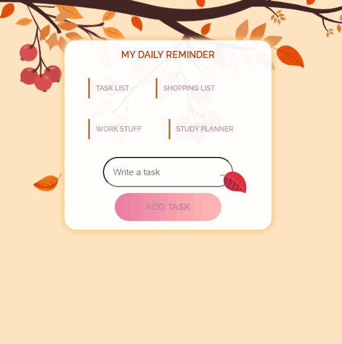

# To do list

I was thinking about an easy program to write down any task or even be used as a shopping list when we go to the supermarket, for example. So, I built this to-do list where you can simply type and add by clicking on the button. It is also possible to mark the ones you've accomplished with a double click on them. 

[]

## My process

### Built with

- HTML
- CSS
- JavaScript

### What I learned

While developing this project it was possible to learn more about and work with different DOM events. 